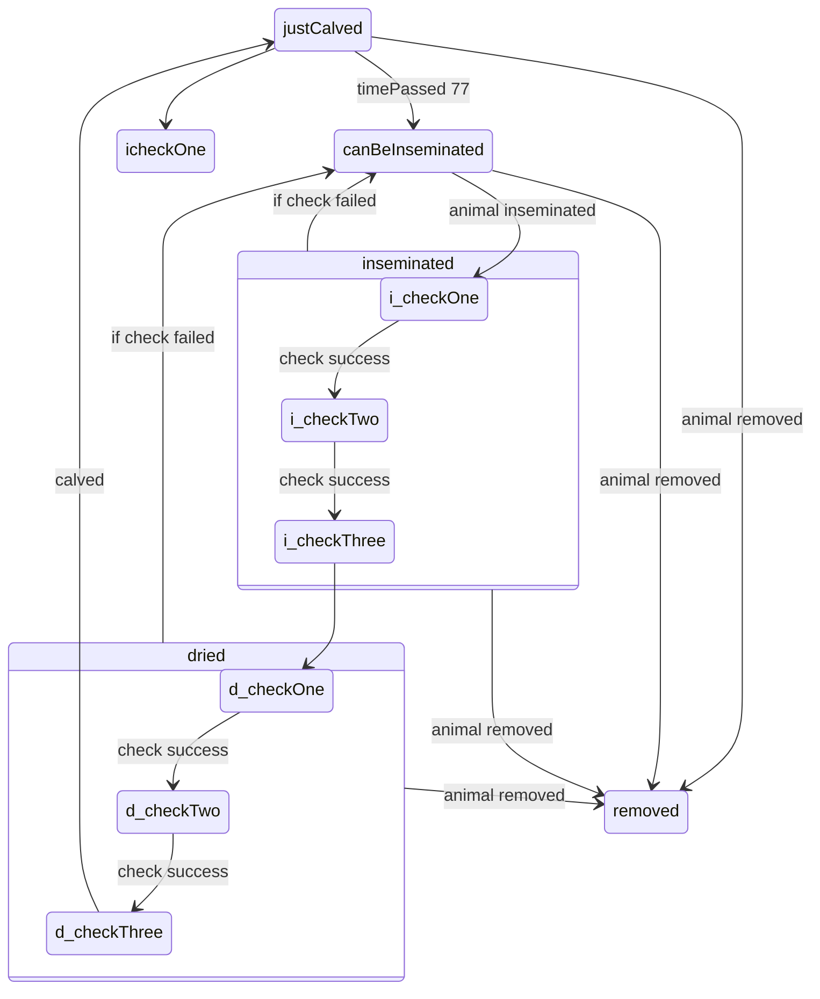

# Actions

## 1.justCalved

    1. congratulate farmer
    1. remind for antibiotics
    1. set cron job for time passed and to canBeInseminated
    1. update timeline

## 2.canBeInsemiated
    1. intimate farmer
    1. update to timeline
## 3. i_checkOne
    1. Congratulate farmer.
    1. Add reminder for next check.
    1. Add reminder for 70 days before calving.
    1. Add reminder for 7 days before calving 
## 4. i_check_failed
    1. change animal state to can be inseminated.
    1. remove reminders set for calving.
## 5. i_checkN
    1. Congratulate farmer.
    1. Add reminder for next check.